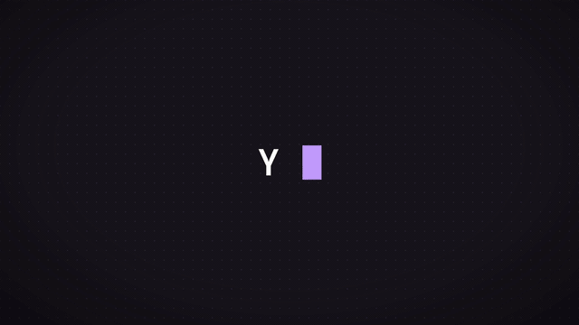

<p align="center">
  
</p>

<h1 align="center">Kiro CV</h1>

<p align="center">
  Your portfolio, disguised as a <a href="https://kiro.dev/cli/">Kiro CLI</a> terminal.<br/>
  Fork it. Make it yours. Land the job.
</p>

<p align="center">
  
</p>

---

## What is this?

A developer portfolio that looks and feels like the real [Kiro CLI](https://kiro.dev/cli/). Visitors explore your experience, skills, and certifications using slash commands — just like Kiro. Plain text input triggers an AI chat that responds in character as you. It's weird, it's fun, and recruiters actually love it.

```
❯ /about          → Summary & current role
❯ /experience     → Work history timeline
❯ /skills         → Technical skills grouped by category
❯ /certs          → Professional certifications
❯ /contact        → Links, socials & email
❯ /download       → Download PDF resume
❯ /model          → Switch between career "models"
❯ /doctor         → Run diagnostics (humorous)
❯ /cost           → Cost analysis report
❯ /tools          → List available tools
❯ /config         → Show configuration
❯ /init           → Generate a fake KIRO.md
❯ Just type...    → Chat with the AI clone
```

## Features

- 🎨 **Authentic Kiro CLI look** — Dot-matrix logo, status line, trust notice, colors
- 💬 **AI Chat** — Visitors can chat with an AI that knows your resume
- ⌨️ **50+ Commands** — Portfolio commands + simulated Kiro CLI commands
- 🎯 **Fully Configurable** — Customize everything via `resume.json`
- 📱 **Responsive** — Works on mobile and desktop
- ⚡ **Fast** — Edge runtime, streaming responses
- ✨ **Smooth Animations** — ViewTransition, @starting-style, custom scrollbar
- 📊 **Telemetry** — Log visitor interactions to JSONL

## Tech Stack

| Category | Technology |
|----------|------------|
| **Framework** | Next.js 16 (App Router, Turbopack) |
| **UI** | React 19.3, Tailwind CSS 4.3 |
| **Language** | TypeScript 7 |
| **AI** | Vercel AI SDK 7 (Edge runtime, streaming) |
| **Runtime** | Node.js 26 |
| **Font** | JetBrains Mono |
| **Data** | JSON Resume format + Kiro extensions |

## Fork & Make It Yours

This project is designed to be forked. Edit `resume.json` and you have your own CLI portfolio:

### Configuration via resume.json

```json
{
  "splash": "YOUR NAME",
  "welcome": "Welcome to my portfolio!",
  "whatsNew": "Now with AI chat support.",
  "trustNotice": "All tools trusted · /help for commands",
  "model": "Senior Engineer 4.0",
  "folder": "~/projects/my-portfolio · (main)",
  
  "basics": { ... },
  "work": [ ... ],
  "skills": [ ... ]
}
```

| Field | Description |
|-------|-------------|
| `splash` | Text displayed in the Kiro dot-matrix logo |
| `welcome` | Welcome message below the logo |
| `whatsNew` | "What's new" announcement |
| `trustNotice` | Trust banner (text before `·` is yellow, after is gray) |
| `model` | Default career model shown in status line |
| `folder` | Path shown in status line (format: `path · (branch)`) |
| `resume` | `message` and `url` for `/resume` |
| `login` | Credentials and hints for the login screen shown on `/quit` |
| `personal` | Optional overrides for `/status`, `/usage`, `/model`, `/skills` categories, `/doctor`, `/cost`, `/init` (defaults in `src/config/personal.ts`) |
| `meta.version` | Version shown in `/help`, `/version`, `/changelog` |

### Resume Data (JSON Resume format)

| Section | Required fields | Used by |
|---------|----------------|---------|
| `basics` | `name`, `label`, `email`, `summary`, `url`, `location`, `profiles[]` | `/about`, `/contact`, AI chat |
| `work[]` | `name`, `position`, `startDate`, `endDate`, `highlights[]` | `/about`, `/experience` |
| `certificates[]` | `name`, `issuer`, `url` | `/certs` |
| `skills[]` | `name`, `keywords[]` | `/skills` |
| `education[]` | `institution`, `area` | `/education` |
| `languages[]` | `language`, `fluency` | `/languages` |
| `projects[]` | `name`, `description`, `highlights[]`, `keywords[]`, `url`, `type` | `/projects` |
| `publications[]` | `name`, `publisher`, `releaseDate`, `url`, `summary` | `/publications` |

### Environment Variables

```env
# Required
OPENAI_API_KEY=

# Optional - AI Configuration
OPENAI_BASE_URL=          # OpenRouter, Groq, local LLMs, ...
OPENAI_MODEL=             # default: gpt-4o-mini
LLM_CHAT_LANGUAGE=        # default: en (or pt-br, es, fr, ...)
LLM_REASONING=            # AI SDK 7: none | minimal | low | medium | high | xhigh

# Optional - Telemetry (requires persistent filesystem)
TELEMETRY_ENABLED=false   # Enable chat logging
TELEMETRY_FILE=           # default: logs/chat-telemetry.jsonl
TELEMETRY_MAX_SIZE_MB=    # default: 10
TELEMETRY_MAX_FILES=      # default: 5

# Optional - Build & Analytics
RESUME_URL=               # Fetch resume.json from URL at build time
NEXT_PUBLIC_GA_ID=        # Google Analytics
```

> **Note**: Telemetry only works on platforms with persistent filesystems (Coolify, VPS, Docker). On Vercel/serverless, logs are lost between invocations.

## Getting Started

```bash
git clone https://github.com/yourusername/kiro-cv.git
cd kiro-cv
pnpm install
```

Create your `.env.local` (see `.env.example`), edit `resume.json`, then:

```bash
pnpm dev     # Start dev server
pnpm build   # Production build
pnpm start   # Start production server
pnpm lint    # Run ESLint
pnpm test    # Run E2E tests (Playwright)
```

## New in This Version

### AI SDK 7 Features
- **`instructions`** — System prompt as a first-class parameter
- **`maxOutputTokens`** — Explicit token limit control
- **`toTextStream()`** — Clean text streaming without data protocol overhead
- **Timeouts** — Configurable `totalMs` and `chunkMs` to prevent hangs
- **Lifecycle callbacks** — `onStart` and `onEnd` for logging
- **Reasoning control** — `LLM_REASONING` env var for models that support it

### UI Animations (2026 CSS/React)
- **React 19.3 ViewTransition** — Smooth enter/exit animations for history items
- **@starting-style** — CSS entry animations without JavaScript
- **Tailwind 4.3 scrollbar** — Native scrollbar styling with `scrollbar-thin`, `scrollbar-thumb-*`
- **prefers-reduced-motion** — All animations respect accessibility settings

### Telemetry
- **JSONL logging** — Log prompts, responses, tokens, and latency to local files
- **File rotation** — Automatic rotation when files exceed size limit
- **Configurable** — Control via environment variables

### System Prompt Improvements
- **Humanized responses** — Natural conversation style, not robotic
- **Better redirects** — Playful off-topic handling instead of formal refusals
- **Good/Bad examples** — Concrete examples for tone calibration
- **Structured guardrails** — Security rules with justifications

## Documentation

- **[docs/DEV.md](docs/DEV.md)** — Full developer manual: architecture, commands, theming
- **[docs/AI_SDK_7_FEATURES.md](docs/AI_SDK_7_FEATURES.md)** — AI SDK 7 features and usage
- **[docs/TEST_PLAN.md](docs/TEST_PLAN.md)** — E2E test coverage and strategy
- **[docs/UPGRADE_PLAN_2026.md](docs/UPGRADE_PLAN_2026.md)** — Migration notes from 2025 stack

## Command Reference

### Portfolio Commands

| Command | Description |
|---------|-------------|
| `/help` | List all commands (interactive selector) |
| `/about` | About me summary |
| `/experience` | Work history timeline |
| `/skills` | Technical skills |
| `/education` | Education background |
| `/certs` | Certifications |
| `/contact` | Contact info & links |
| `/languages` | Languages spoken |
| `/resume` | Download resume |

### Kiro CLI Commands (Simulated)

| Command | Description |
|---------|-------------|
| `/model` | Switch career model |
| `/clear` | Clear terminal |
| `/compact` | Compact context |
| `/tools` | List tools |
| `/config` | Show configuration |
| `/status` | Session status |
| `/version` | Version info |
| `/todos` | Task list |

### Fun Commands

| Command | Description |
|---------|-------------|
| `/doctor` | Skill diagnostics |
| `/cost` | Humorous cost analysis |
| `/init` | Generate KIRO.md |
| `/game` | Kiro Ghost runner easter egg |

## Testing

The project includes 51 E2E tests using Playwright:

```bash
pnpm test              # Run all tests
pnpm test:ui           # Run with Playwright UI
pnpm test:headed       # Run in headed browser
```

Tests cover:
- Startup and welcome screen
- All 50+ commands
- AI chat with mocked responses
- Easter eggs (/game, /quit login, sudo hire)
- UX (keyboard navigation, autocomplete, history)

---

<p align="center">
  Originally created by <a href="https://github.com/ambaena/claude-code-resume">Alfonso Baena</a> · Kiro-styled by <a href="https://github.com/fabricioctelles">Fabricio Telles</a>
</p>
<p align="center">
  Built with <a href="https://kiro.dev">Kiro</a> · MIT License
</p>
<p align="center">
  <sub>Not affiliated with Amazon/AWS. Just a fan of the CLI aesthetic.</sub>
</p>
